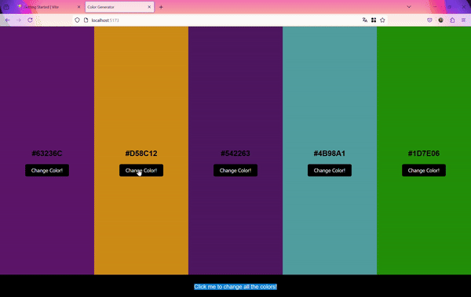

# 🎨 Color Generator

A simple and interactive web application that allows users to generate random color palettes or customize individual colors. Built with pure HTML, CSS, and JavaScript.

---

## 🚀 Features

- Generate random color palettes with a single click.
- Customize individual colors in the palette.
- User-friendly and responsive design.

---

## 📸 Demo




## 🛠️ Built With

- **HTML**
- **CSS**
- **JavaScript**

---

## 📂 Getting Started

To clone and run this project locally, follow these steps:

1. **Clone the repository:**
   ```bash
   git clone https://github.com/your-username/color-generator.git


2. **Navigate to the project folder:**
   ```bash
   cd color-generator


4. **Install dependencies: Vite requires dependencies to be installed. Run:**
   ```bash
   npm install
 
  
6. **Start the development server: Launch the Vite development server:**
     ```bash
     npm run dev

  
8. **Open the project in your browser:**
  Vite will provide a local development URL (usually http://localhost:5173/). Open this link in your browser.

10. **Start generating and customizing palettes!** 🎨
 


